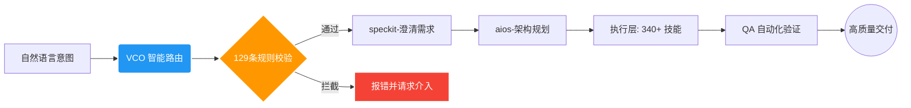

<div align="center">

# 🌊 Vibe-Skills: 全能型 AI 操作系统 (VCO Runtime)

<!-- 动态打字效果：展示核心价值 -->


**集 340+ 技能矩阵、MCP 入口与受管工作流于一体的 AI 核心能力栈。**

[](https://opensource.org/licenses/MIT)
[](https://github.com/foryourhealth111-pixel/Vibe-Skills/stargazers)
[](https://modelcontextprotocol.io)
[](http://makeapullrequest.com)

[**⚡ 快速开始**](#-快速开始-ttv--1-分钟) • [**🧠 340+ 技能矩阵**](#-全谱系能力全景图-340-skills) • [**🛡️ 治理体系**](#-治理即特性-governance-as-a-feature) • [**🔌 生态集成**](#-mcp--生态融合-19-ecosystems)

</div>

---

## 💡 核心叙事：为什么要用 Vibe-Skills？

在 **"Vibe Coding"** 范式下，开发者通过意图指挥 AI。但当前的 AI Agent 往往处于“野蛮生长”状态：
- ❌ **上下文污染**：LLM 在复杂任务中容易迷失，陷入幻觉死循环。
- ❌ **执行发散**：缺乏约束的 Agent 会做出非预期的破坏性操作。
- ❌ **提示词地狱**：为了稳定输出，开发者被迫维护数千行的 Prompt。

**Vibe-Skills (VCO 运行时)** 将 AI 的灵性与工程的确定性完美融合。它不仅是工具箱，更是您的 **AI 操作系统内核**。只需一条指令 `/vibe`，系统将自动路由至最合适的技能，并在 129 条治理规则的护栏内完成任务。

---

## 🏗️ 架构设计：受管工作流 (Managed Workflow)

我们拒绝“黑盒执行”。Vibe-Skills 严格执行 `澄清 ➔ 规划 ➔ 执行 ➔ 验证` 的有向无环图 (DAG) 架构。



---

## 🧠 全谱系能力全景图 (340+ Skills)

这里展示了 Vibe-Skills 扎实的能力底座。我们将其划分为针对不同专业领域的“能力域”：

| 能力域 | 核心技能示例 | 适用人群 |
| :--- | :--- | :--- |
| **💻 软件工程** | `autonomous-builder`, `gh-fix-ci`, `tdd-guide`, `error-resolver` | 架构师、全栈工程师 |
| **👔 产品与增长** | `speckit-clarify`, `aios-pm`, `market-research-reports` | 产品经理、增长黑客 |
| **🧬 生命科学** | `biopython`, `scanpy`, `literature-review`, `protein-folding` | 科研人员、生物信息学者 |
| **📊 数据与 AI** | `senior-ml-engineer`, `statistical-analysis`, `rag-evaluation` | 数据科学家、算法工程师 |
| **⚙️ 自动化/系统** | `playwright-browser`, `mcp-bridge`, `system-orchestrator` | DevOps、自动化专家 |

<details>
<summary><b>🔍 查看 340+ 技能全量注册表</b></summary>
<br/>
您可以访问 <a href="./docs/skills-registry.md">/docs/skills-registry.md</a> 查看包含 YAML/JSON 定义的完整字典。涵盖从需求分析到生产落地的端到端全链路工具。
</details>

---

## 🛡️ 治理即特性 (Governance-as-a-Feature)

Vibe-Skills 拥有 **129 条严格治理规则**，确保 AI 代理在安全、合规、确定的轨道上运行。

- **确定性退出**：强制执行预算上限与死循环检测，防止 Token 资源枯竭。
- **环境隔离**：每个 Skill 执行环境互不干扰，防止上下文污染。
- **人类在环 (HITL)**：关键节点（如删除操作、代码部署）强制触发用户确认。
- **执行留痕**：所有 Agent 操作均可追溯、可复现、可审计。

---

## 🔌 MCP & 生态融合 (19+ Ecosystems)

Vibe-Skills 原生支持 **Model Context Protocol (MCP)**，作为跨生态的超级粘合剂。

- **跨域调用**：让 AI 直接读取您的 Notion 需求，通过 Slack 讨论，并在 GitHub 上提交 PR。
- **深度整合**：集成了 `superpower`, `spec-kit`, `DeepAgent` 等 19+ 顶级开源项目的最佳实践。

---

## ⚡ 快速开始 (TTV < 1 分钟)

**1. 准备环境**
```bash
git clone https://github.com/foryourhealth111-pixel/Vibe-Skills.git
cd Vibe-Skills
# 支持 PowerShell (60.7%) 与 Python (31.3%) 混合运行时
```

**2. 见证奇迹 (Aha! Moment)**
在支持的主机环境（如 Claude Code 或 Codex）中输入：
```bash
/vibe "帮我规划一个 Next.js SaaS 架构，自动生成脚手架，并依据 governance 规则执行安全扫描。"
```

> **🎥 演示：**
> <br>
> 

---

## 🤝 贡献与共建

Vibe-Skills 的强大源于社区。通过我们内置的 `skill-creator` 工具，您可以在几分钟内封装自己的技能。

1. 运行 `skill-creator "My Tool Name"`
2. 按提示填写 YAML 定义
3. 提交 PR，加入全球 AI OS 贡献者行列！

---

<div align="center">
<b>加入 Vibe 生态，定义下一代自主开发范式。</b><br>
<sub>标签：<code>ai-agents</code> <code>mcp-server</code> <code>vibe-coding</code> <code>ai-governance</code> <code>devsecops</code></sub>
</div>
